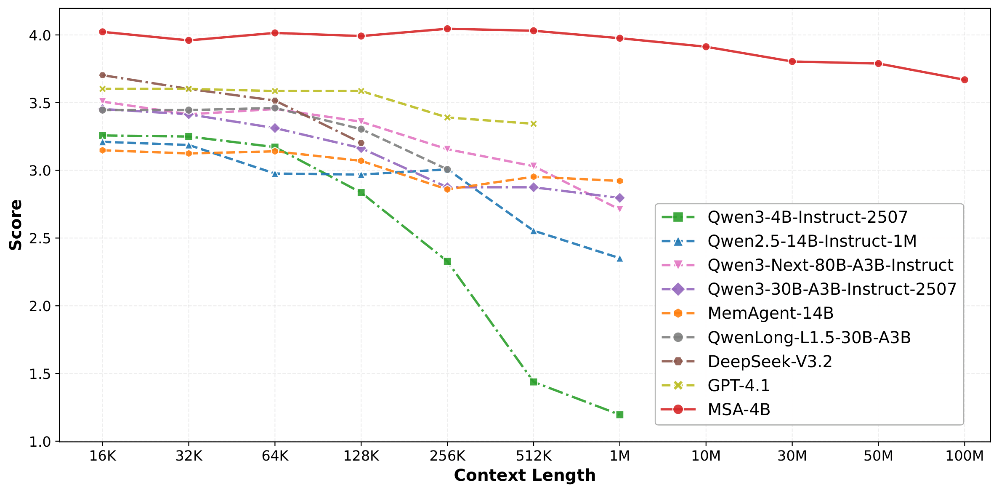

# MSA: Memory Sparse Attention

_一个可扩展的端到端可训练的潜在记忆框架，用于100M令牌上下文_

[**Paper**](./paper/MSA__Memory_Sparse_Attention_for_Efficient_End_to_End_Memory_Model_Scaling_to_100M_Tokens.pdf) • [**Code**](Coming Soon) • [**Models**](Coming Soon)

[](https://opensource.org/licenses/MIT)

---

## 📝 摘要

长期记忆对于通用智能至关重要，但**全注意力**瓶颈限制了大多数LLM的**有效上下文长度**为**128K–1M**。现有的尝试，混合线性注意力、固定大小状态记忆（例如RNN）和外部存储如**RAG/agents**，要么在极端规模下遭受快速精度衰减和延迟增长，要么缺乏端到端可微分性或动态记忆维护，要么需要复杂的管道。我们提出了**Memory Sparse Attention (MSA)**：一个**端到端可训练、可扩展的稀疏** **潜在状态记忆**框架。核心思想包括：

- **可扩展稀疏注意力** + **文档级RoPE**（并行/全局）实现训练和推理中的**近线性复杂度**；
- **KV缓存压缩**与**Memory Parallel**推理引擎，在**2×A800** GPU上提供**100M令牌**吞吐量；
- **Memory Interleave**用于多轮、多跳推理跨越分散的记忆段。

在长上下文QA和NIAH（Needle-in-a-Haystack）基准测试中，**MSA**超越了相同骨干的RAG、最佳RAG栈和领先的长上下文模型。在前所未有的**16K→100M令牌**范围内，MSA显示**< 9%**降级，表明了将记忆容量与推理解耦的实用路径。

> **从16K→100M令牌扩展**：MSA将top-k选择与稀疏注意力融合，以保持端到端可微分性，同时允许在推理时文档解耦。在MS MARCO上，MSA维持**<9%**降级并显示出强大的外推性。
> _一些基准曲线由于其上下文限制而提前结束。_


_图1：MSA在极端长上下文下的可扩展性_

---

## ✨ 主要贡献

- **Memory-Sparse Attention (MSA)**：一个**端到端可训练**、**可扩展稀疏注意力**层，具有**文档级RoPE**，实现**O(L)**复杂度和**<9%**从**16K→100M令牌**的降级。
- **KV缓存压缩 + Memory Parallel**：分层存储（GPU驻留路由键，CPU内容K/V），分布式评分和按需传输，以在**2×A800**上启用**100M令牌**推理。
- **Memory Interleave**：自适应交替"生成检索→上下文扩展→生成"，显著提升跨文档的**多跳**推理。
- **全面评估**：MSA在长上下文QA和NIAH上超越相同骨干RAG、最佳RAG管道和顶级长上下文模型，显示出卓越的**稳定性**和**准确性**。

---

## 🧩 整体设计

### 架构

MSA将**检索和生成**集成到一个可微分的循环中。文档潜在状态（**K/V/Kᵣ**）通过**块均值池化**进行压缩。**路由投影器**通过余弦相似度计算相关性（在头部上均值池化，然后逐令牌最大值），选择**Top‑k文档**，然后将其**压缩K/V**与查询的本地**K/V**连接用于自回归解码。路由仅适用于**上层**；下层保持**独立文档处理**以实现层次对齐。

- **并行（文档级）RoPE**：每个文档从0重置位置，防止**训练短**和**推理长**之间的位置漂移，实现64k训练外推到100M。
- **全局RoPE（活动上下文）**：查询的起始索引由k（Top‑k检索块）偏移，保持因果顺序：_背景→查询→生成_。

**图2：MSA层（稀疏注意力 + 文档级RoPE）**


_图2：Memory-Sparse Attention层和并行/全局RoPE_

---

### 推理管道

MSA使用**三阶段**管道（图3）：

1. **全局记忆编码（离线）**：在语料库上向前缓存块池化**（K̄, V̄, K̄ᵣ）**。
2. **在线路由和上下文组装**：将查询投影到**Qᵣ**，与**K̄ᵣ**匹配以选择**Top‑k**，然后仅加载选定的**K̄/V̄**并与本地上下文连接。
3. **稀疏生成**：在**稀疏上下文**上自回归。

**Memory Parallel**跨GPU分片**K̄ᵣ**（查询广播→本地评分→全局减少）。内容**K̄/V̄**留在主机DRAM中，并在选择时**异步获取**——平衡**VRAM**和**吞吐量**以进行**100M令牌**部署。

**图3：三阶段推理和Memory Interleave**


_图3：离线编码→在线路由→稀疏生成；可选的多轮交织用于多跳_

---

## 🚀 结果

> **设置**
> **QA**：9个数据集（MS MARCO v1, NQ, DuReader, TriviaQA(10M), NarrativeQA, PopQA, 2WikiMultiHopQA, HotpotQA, MuSiQue），记忆库**277K→10M令牌**，指标：**LLM评判（0–5）**。
> **NIAH (RULER)**：8个子任务，**32K→1M令牌**，报告平均准确率。
> **骨干**：Qwen3‑4B‑Instruct‑2507。与相同骨干RAG和最佳RAG栈（KaLMv2 + 大型生成器，可选重排序器）比较。

### 表2：MSA vs 相同骨干RAG (Qwen3‑4B)

**总结**：平均**3.760**，相对于标准RAG（**+16.0%**）、RAG+重排序（**+11.5%**）和HippoRAG2（**+14.8%**）使用其最佳@k；MSA在相同骨干组中领先于除NarrativeQA外的所有。

| Dataset           | Tokens | Qwen3-4B R@1 | R@5   | R@10  | Qwen3-4B (RR) R@1 | R@5          | R@10         | HippoRAG2 R@1 | R@5          | R@10         | MSA (adaptive) |
| ----------------- | ------ | ------------ | ----- | ----- | ----------------- | ------------ | ------------ | ------------- | ------------ | ------------ | -------------- |
| MS MARCO v1       | 7.34M  | 2.893        | 3.011 | 3.005 | 2.934             | <u>3.032</u> | 3.017        | 2.676         | 3.005        | 3.019        | **4.141**      |
| Natural Questions | 1.47M  | 3.452        | 3.374 | 3.297 | <u>3.494</u>      | 3.408        | 3.385        | 3.338         | 3.389        | 3.374        | **3.545**      |
| DuReader          | 277K   | 3.726        | 3.579 | 3.594 | <u>3.848</u>      | 3.618        | 3.607        | 2.941         | 3.485        | 3.415        | **4.155**      |
| TriviaQA (10M)    | 10M    | 4.133        | 4.414 | 4.273 | 4.313             | 4.375        | 4.391        | 4.188         | <u>4.430</u> | 4.367        | **4.621**      |
| NarrativeQA       | 538K   | 1.611        | 2.567 | 2.860 | **3.638**         | 3.492        | <u>3.536</u> | 1.959         | 2.628        | 2.655        | 3.395          |
| PopQA             | 1.18M  | 2.959        | 3.273 | 3.299 | <u>3.315</u>      | 3.264        | 3.266        | 3.111         | 3.249        | 3.249        | **3.433**      |
| 2WikiMultiHopQA   | 722K   | 1.065        | 3.055 | 3.136 | 1.187             | 3.057        | 3.159        | 1.045         | 3.180        | <u>3.330</u> | **4.280**      |
| HotpotQA          | 1.35M  | 2.252        | 3.582 | 3.787 | 2.642             | 3.990        | <u>4.022</u> | 3.230         | 3.770        | 3.970        | **4.061**      |
| MuSiQue           | 1.41M  | 0.936        | 1.752 | 1.928 | 1.144             | 1.960        | 1.965        | 1.020         | 1.907        | <u>2.095</u> | **2.211**      |
| **Average**       | —      | 2.559        | 3.179 | 3.242 | 2.946             | 3.355        | <u>3.372</u> | 2.612         | 3.227        | 3.275        | **3.760**      |

_表2：相同骨干RAG vs MSA (@1/@5/@10 vs MSA @adaptive)_

---

### 表3：MSA vs 最佳RAG (大型骨干)

**总结**：针对**KaLMv2+Qwen3‑235B**和**KaLMv2+Llama‑3.3‑70B**（有/无重排序），MSA在**4/9**数据集上取得最佳分数，平均**3.760**，相对于最强配置分别获得**+7.2%**、**+5.0%**、**+10.7%**和**+5.4%**的相对增益。少数数据集上的差距（例如MuSiQue）主要归因于参数数量和内在推理能力。

| Dataset           | KaLMv2 + Qwen3‑235B R@1 | R@5          | R@10         | Qwen3‑235B (RR) R@1 | R@5       | R@10         | KaLMv2 + Llama‑3.3 R@1 | R@5       | R@10         | Llama‑3.3 (RR) R@1 | R@5   | R@10         | MSA (adaptive) |
| ----------------- | ----------------------- | ------------ | ------------ | ------------------- | --------- | ------------ | ---------------------- | --------- | ------------ | ------------------ | ----- | ------------ | -------------- |
| MS MARCO v1       | 2.846                   | <u>3.028</u> | 3.027        | 2.886               | 3.020     | 2.995        | 2.649                  | 2.904     | 2.919        | 2.881              | 2.955 | 2.952        | **4.141**      |
| Natural Questions | <u>3.711</u>            | 3.670        | 3.694        | 3.621               | 3.610     | 3.645        | 3.675                  | 3.674     | 3.662        | **3.756**          | 3.665 | 3.647        | 3.545          |
| DuReader          | 4.044                   | 3.991        | 3.978        | 3.973               | 3.932     | 3.891        | <u>4.051</u>           | 3.846     | 3.742        | 3.967              | 3.776 | 3.780        | **4.155**      |
| TriviaQA (10M)    | 4.367                   | 4.656        | 4.578        | 4.492               | 4.320     | 4.555        | 4.273                  | **4.740** | <u>4.719</u> | 4.547              | 4.703 | 4.695        | 4.621          |
| NarrativeQA       | 1.413                   | 2.130        | 2.427        | 3.212               | **3.427** | 3.375        | 1.290                  | 2.123     | 2.382        | 3.150              | 3.263 | 3.317        | <u>3.395</u>   |
| PopQA             | 2.810                   | 3.347        | <u>3.396</u> | 3.268               | 3.380     | 3.376        | 2.787                  | 3.298     | 3.305        | 3.337              | 3.384 | 3.362        | **3.433**      |
| 2WikiMultiHopQA   | 2.646                   | 3.579        | 3.582        | 1.855               | 3.381     | <u>3.583</u> | 1.339                  | 3.263     | 3.445        | 1.651              | 3.332 | 3.541        | **4.280**      |
| HotpotQA          | 3.497                   | 4.090        | **4.225**    | 3.341               | 4.141     | 4.194        | 3.070                  | 3.896     | 4.127        | 3.428              | 4.145 | <u>4.203</u> | 4.061          |
| MuSiQue           | 1.988                   | 2.462        | **2.647**    | 1.801               | 2.522     | 2.605        | 1.704                  | 2.317     | 2.258        | 1.895              | 2.462 | <u>2.614</u> | 2.211          |
| **Average**       | 3.036                   | 3.439        | 3.506        | 3.161               | 3.526     | <u>3.580</u> | 2.760                  | 3.340     | 3.396        | 3.179              | 3.521 | 3.568        | **3.760**      |

_表3：SOTA RAG栈（强检索器 + 大型生成器 + 可选重排序器）vs MSA_

---

### 图4：RULER NIAH稳定性 (32K→1M)

**总结**：MSA在**1M令牌**时维持**94.84%**。未修改的骨干在**128K**之外崩溃（在**1M**时降至**24.69%**）。混合线性注意力长上下文模型在**≥128K/256K**时明显降级。外部记忆代理（例如RL‑MemoryAgent‑14B）保持稳定，但在**绝对准确性**上较弱，并且比MSA显示出更陡峭的衰减。


_图4：准确率 vs 上下文长度（越高越好）_

---

## 实现说明

- **训练**：158.95B令牌连续预训练与**辅助路由损失**，随后两阶段SFT（**8k→64k**课程）。
- **消融**（论文表4）：课程扩展、Memory Interleave、连续预训练和注入原始文本都显著贡献；移除它们会导致**5%–37%**的下降，取决于任务。

---

## 引用

```bibtex
@misc{chen_2026_19103670,
  author       = {Chen, Yu and
                  Chen, Runkai and
                  Yi, Sheng and
                  Zhao, Xinda and
                  Li, Xiaohong and
                  Zhang, Jianjin and
                  Sun, Jun and
                  Hu, Chuanrui and
                  Han, Yunyun and
                  Bing, Lidong and
                  Deng, Yafeng and
                  Chen, Tianqiao},
  title        = {MSA: Memory Sparse Attention for Efficient End-to-
                   End Memory Model Scaling to 100M Tokens
                  },
  month        = mar,
  year         = 2026,
  publisher    = {Zenodo},
  doi          = {10.5281/zenodo.19103670},
  url          = {https://doi.org/10.5281/zenodo.19103670},
}
```

### 致谢

此仓库和文档页面由MSA作者维护。有关项目更新，请访问**主页**：https://evermind.ai/</content>
<parameter name="filePath">/Users/ziji/personal/github/MSA/README_zh.md
